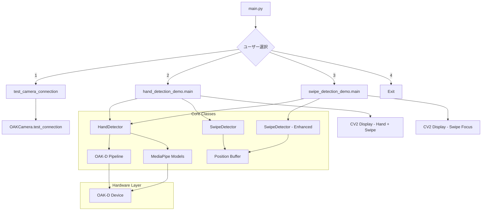
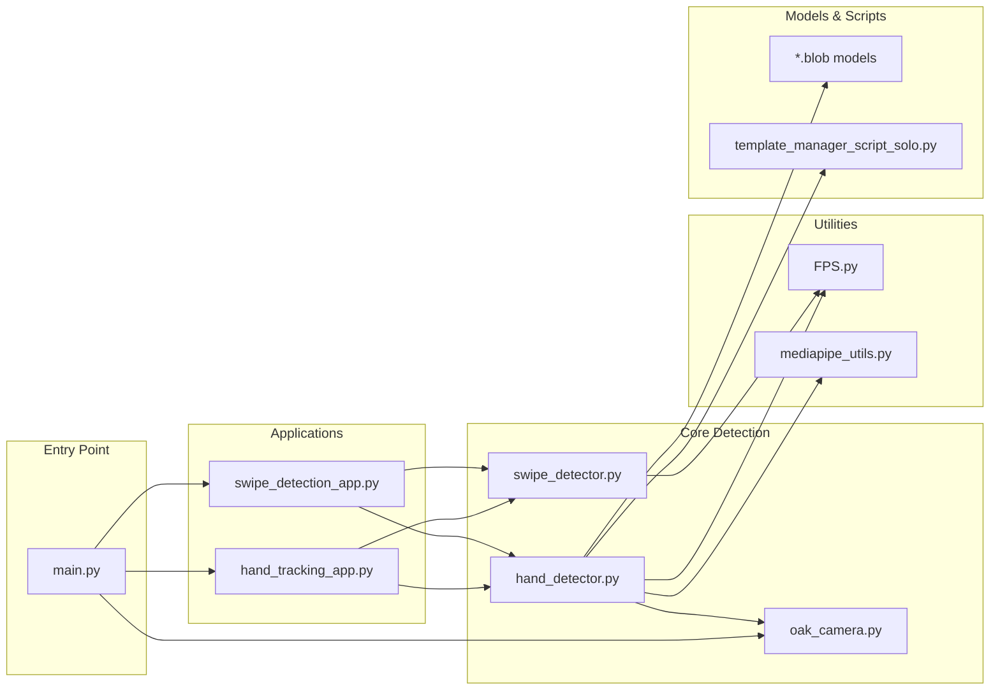
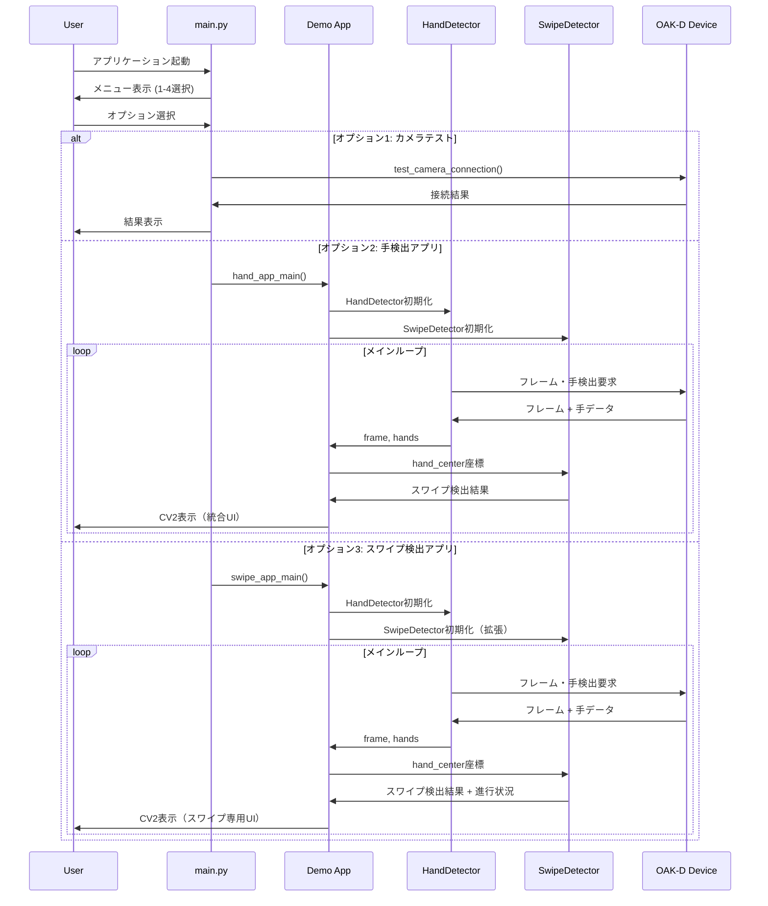

# アプリケーション全体構成図

## 概要
OAK-D Gesture Recognition Applicationの全体アーキテクチャとクラス関係図

---

## メインアプリケーション構成



---

## ファイル関係詳細図



---

## クラス継承・依存関係

### main.py の役割
```python
main.py
├── import hand_tracking_app as hand_app_main
├── import swipe_detection_app as swipe_app_main  
├── import test_camera_connection
└── メニューループ制御
```

### 各アプリケーションの構成

#### hand_tracking_app.py
```python
hand_tracking_app.py
├── HandDetector インスタンス生成
├── SwipeDetector インスタンス生成
├── メインループ
│   ├── detector.get_frame_and_hands()
│   ├── swipe_detector.update(hand_center)
│   ├── draw_hand_landmarks()
│   └── CV2表示（手検出 + スワイプ統合）
└── 統計表示・クリーンアップ
```

#### swipe_detection_app.py  
```python
swipe_detection_app.py
├── HandDetector インスタンス生成
├── SwipeDetector インスタンス生成（拡張設定）
├── メインループ
│   ├── detector.get_frame_and_hands()
│   ├── swipe_detector.update(hand_center)
│   ├── draw_swipe_trail() # 軌跡描画
│   ├── draw_swipe_zone() # 検出ゾーン
│   └── CV2表示（スワイプ専用UI）
└── モード切替・統計表示
```

---

## データフロー図



---

## 設定・カスタマイズポイント

### main.py レベル
| 場所 | 設定内容 | ファイル:行番号 |
|------|----------|----------------|
| メニュー項目追加 | 新しいデモ追加 | main.py:9-13 |
| デモ選択分岐 | 選択肢処理 | main.py:17-41 |

### デモアプリケーションレベル  
| デモ | 設定内容 | ファイル:行番号 |
|------|----------|----------------|
| hand_detection_demo | HandDetector設定 | hand_detection_demo.py:50-56 |
| hand_detection_demo | SwipeDetector設定 | hand_detection_demo.py:58-67 |
| swipe_detection_demo | 精度プリセット | swipe_detection_demo.py:154-176 |
| swipe_detection_demo | UI表示設定 | swipe_detection_demo.py:80-140 |

### コアクラスレベル
| クラス | 設定内容 | ファイル:行番号 |
|--------|----------|----------------|
| HandDetector | カメラ解像度・FPS | hand_detector.py:16-27 |
| HandDetector | 検出閾値 | hand_detector.py:19-26 |
| SwipeDetector | 検出パラメータ | swipe_detector.py:16-34 |
| OAKCamera | ハードウェア設定 | oak_camera.py |

---

## 起動フロー

### 1. アプリケーション起動
```bash
python main.py
```

### 2. 処理フロー
```python
main()
├── メニュー表示ループ
├── ユーザー入力受付
├── 選択に応じた処理分岐
│   ├── test_camera_connection() # OAK-D接続テスト
│   ├── hand_demo_main()        # 手検出統合デモ
│   ├── swipe_demo_main()       # スワイプ検出専用デモ  
│   └── exit()                  # アプリケーション終了
└── 例外処理・クリーンアップ
```

### 3. デモ起動時の初期化順序
```python
# 共通初期化
HandDetector インスタンス生成
├── OAK-Dパイプライン構築
├── MediaPipeモデル読込
├── デバイス接続
└── 出力キュー設定

SwipeDetector インスタンス生成  
├── バッファ初期化
├── パラメータ設定
└── 状態変数初期化

# メインループ開始
while True:
    フレーム取得 → 手検出 → スワイプ検出 → 表示
```

---

## 依存関係マトリックス

| ファイル | OAK-D | OpenCV | MediaPipe | NumPy | Collections |
|----------|-------|--------|-----------|-------|-------------|
| main.py | ❌ | ❌ | ❌ | ❌ | ❌ |
| hand_detection_demo.py | ⭕ | ⭕ | ⭕ | ⭕ | ❌ |
| swipe_detection_demo.py | ⭕ | ⭕ | ⭕ | ⭕ | ❌ |
| hand_detector.py | ⭕ | ⭕ | ⭕ | ⭕ | ❌ |
| swipe_detector.py | ❌ | ❌ | ❌ | ⭕ | ⭕ |
| oak_camera.py | ⭕ | ⭕ | ❌ | ❌ | ❌ |

---

## 新しいデモ追加方法

### 1. 新しいデモファイル作成
```python
# src/gesture_oak/demos/new_demo.py
def main():
    # デモロジック実装
    pass
```

### 2. main.py への統合
```python
# main.py
from src.gesture_oak.demos.new_demo import main as new_demo_main

# メニュー項目追加
print("4. Run new demo")

# 分岐処理追加
elif choice == '4':
    print("\n--- New Demo ---")
    new_demo_main()
```

### 3. メニュー番号の調整
```python
# Exit番号を変更
elif choice == '5':  # 4 → 5
    print("Goodbye!")
    break
```

---

## アーキテクチャ特徴

### 🏗️ **モジュラー設計**
- main.pyは薄い制御層
- 各デモは独立したアプリケーション
- コアクラスは再利用可能

### 🔧 **設定の階層化**
- アプリケーションレベル（main.py）
- デモレベル（*_demo.py）  
- クラスレベル（detector.py）

### 🚀 **拡張性**
- 新しいデモの簡単追加
- 既存コアクラスの再利用
- 独立したテスト・デバッグ可能

### 🛡️ **エラーハンドリング**
- 各レベルでの例外処理
- グレースフルな終了処理
- ハードウェア接続エラー対応